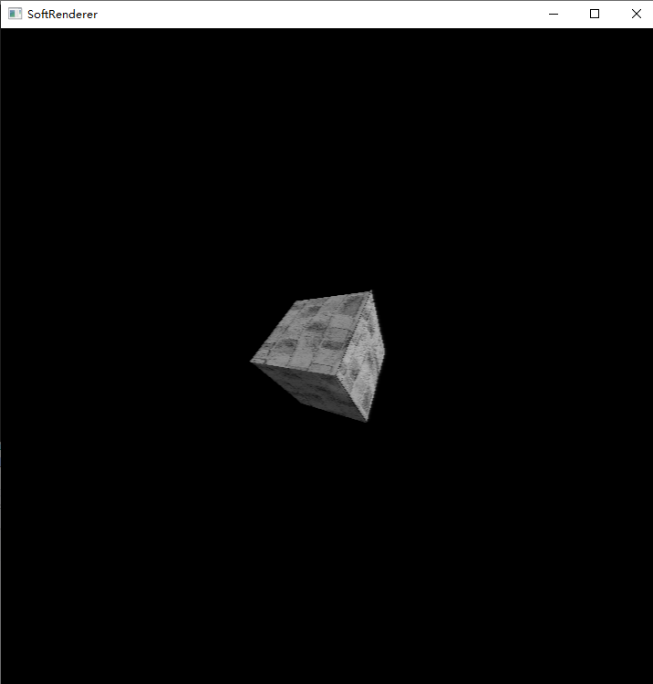

# little soft renderer

a soft renderer demo implemented in C++

## techs 
-  basic mvp transform
-  soft rasterization
-  phone shading
-  use glfw for window managing and glm for matrix data and texture data storage
-  use win api GL.h for draw pixels
-  oop encapsulation

## result    

